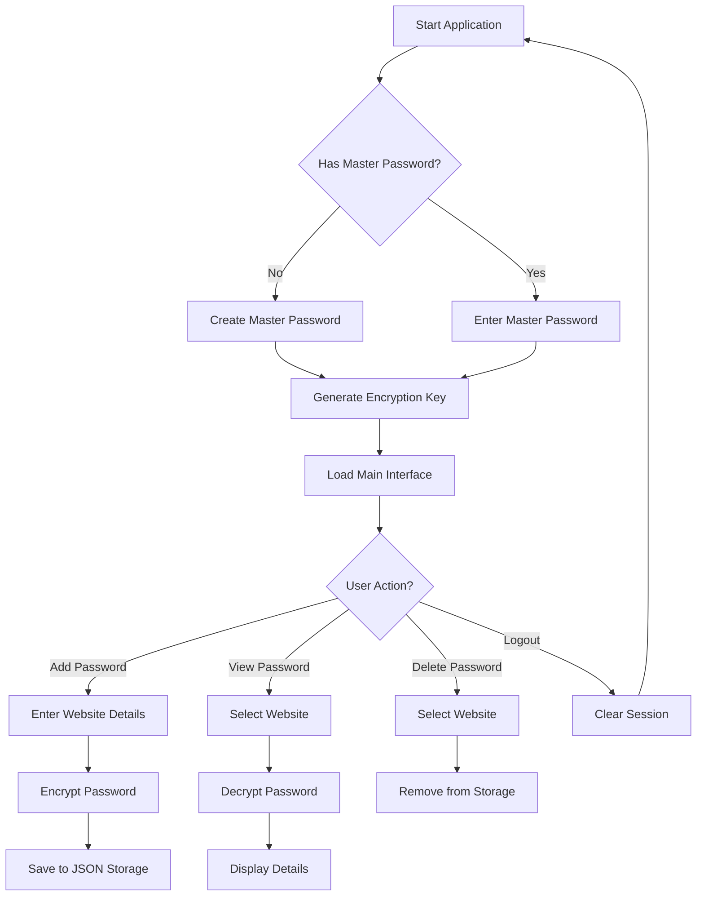
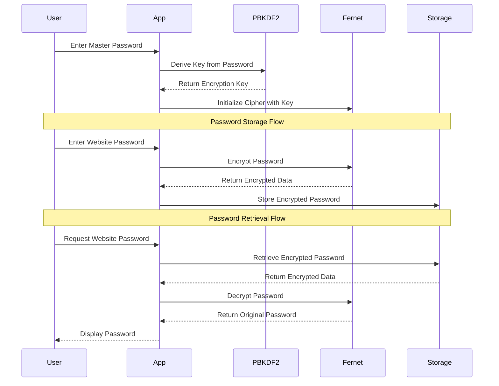

# 🔐 Secure Password Manager


A lightweight, secure password management solution built with Flask and modern cryptography principles. This project demonstrates practical cybersecurity concepts including encryption, key derivation, and secure data storage in a user-friendly web application.

## 📄 Overview

The Secure Password Manager allows users to safely store and retrieve website credentials using strong encryption. All passwords are encrypted with a master password that only you know, ensuring your sensitive information remains protected.


*The application starts with a secure login screen, requiring your master password to decrypt stored credentials*

## 🔍 Features

- 🔒 Strong encryption of all stored passwords using Fernet symmetric encryption
- 🔑 Master password protection with PBKDF2HMAC key derivation
- 🌐 Simple web interface for managing website credentials 
- 🛡️ Zero plaintext storage of sensitive information
- 📱 Responsive design that works on desktop and mobile devices

## 🧪 Security Implementation

- **End-to-End Encryption**: All passwords are encrypted before storage
- **PBKDF2HMAC**: Password-Based Key Derivation Function with HMAC for secure key generation
- **Fernet Encryption**: Symmetric encryption scheme that guarantees authenticity
- **Secure Session Management**: Flask sessions for user authentication
- **No Plain-Text Storage**: Sensitive data is never stored unencrypted

## 🔄 Application Workflow



## 🛠️ Technical Components

- **Flask**: Web framework for the application
- **Cryptography Library**: Handles encryption and decryption
- **PBKDF2**: Converts master password into secure encryption key
- **JSON Storage**: Stores encrypted passwords in a structured format

## 📁 Project Structure

```
.
├── app.py                 # Main Flask application
├── password_manager.py    # Core encryption and storage logic
├── requirements.txt       # Project dependencies
├── templates/             # HTML templates
│   ├── index.html         # Main interface template
│   └── layout.html        # Base template layout
└── passwords.json         # Encrypted password storage (created on first use)
```

## 🚀 Getting Started

### Setting Up with SSH

This section demonstrates how to set up the project using SSH authentication with GitHub:

```bash
# Check for existing SSH keys
user@machine % ls -la ~/.ssh
# Output shows your SSH keys and related files

# Copy the public key to clipboard 
user@machine % pbcopy < ~/.ssh/id_ed25519.pub

# Test SSH connection to GitHub
user@machine % ssh -T git@github.com
Enter passphrase for key '/Users/username/.ssh/id_ed25519': 
Hi username! You've successfully authenticated, but GitHub does not provide shell access.

# Clone the repository using SSH
user@machine % git clone git@github.com:username/Password_Manager_With_Encryption_Project.git
```

### Installation

1. Clone the repository:
```bash
git clone git@github.com:fahmizainal17/Password_Manager_With_Encryption_Project.git
cd Password_Manager_With_Encryption_Project
```

2. Create and activate a virtual environment:
```bash
python3 -m venv venv_fahmi
source venv_fahmi/bin/activate  # On Windows: venv_fahmi\Scripts\activate
```

3. Install dependencies:
```bash
pip install -r requirements.txt
```

4. Run the application:
```bash
flask run --debug
```

5. Access the web interface in your browser:
```
http://127.0.0.1:5000
```

## 🖥️ Using the Application

### First-Time Setup

1. When you first launch the application, you'll see the login screen:
   
   
   *The master password screen where you enter your encryption key*

2. Create a master password - this will be used to encrypt all your stored passwords
3. Remember this master password! If you forget it, you won't be able to recover your stored passwords

### Managing Passwords

1. After logging in with your master password, you'll see the main interface with two sections:
   
   
   *The main interface with saved websites list on the left and form to add new passwords on the right*

2. To add a new password:
   - Fill out the website, username, and password fields
   - Click "Save Password"

3. To view a stored password:
   - Click on the website name from the list on the left
   - The username and password will be displayed as shown below:
   
   
   *Password details view showing the username and password for a selected website*

4. To delete a password:
   - Select the website from the list
   - Click the "Delete" button

### Behind the Scenes: Encryption

Your passwords are stored in an encrypted format in the passwords.json file. Even if someone gains access to this file, they cannot read your passwords without your master password:


*Example of how passwords are stored in encrypted format in the JSON file*

## 🔐 Encryption Process



## 🔧 Customization

You can customize the application by:

- Modifying the templates for a different visual design
- Changing the storage location in `password_manager.py`
- Adding password strength checking
- Implementing additional security features

## 🛡️ Security Considerations

For a real-world application, consider these security enhancements:

1. Use a more secure salt generation and storage method
2. Implement stronger authentication (like 2FA)
3. Add a password strength checker
4. Implement proper error handling and logging
5. Add rate limiting on failed login attempts
6. Set secure cookie flags
7. Implement audit logging

## 📚 References

- [Flask Documentation](https://flask.palletsprojects.com/)
- [Cryptography Package Documentation](https://cryptography.io/en/latest/)
- [PBKDF2 (Password-Based Key Derivation Function 2)](https://en.wikipedia.org/wiki/PBKDF2)
- [Fernet Specification](https://github.com/fernet/spec/blob/master/Spec.md)

## 📜 License

Copyright (c) 2023 Fahmi Zainal

This project is licensed for personal and educational use only. Modification and redistribution require explicit permission from the author.